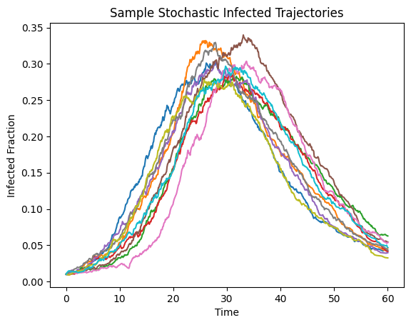
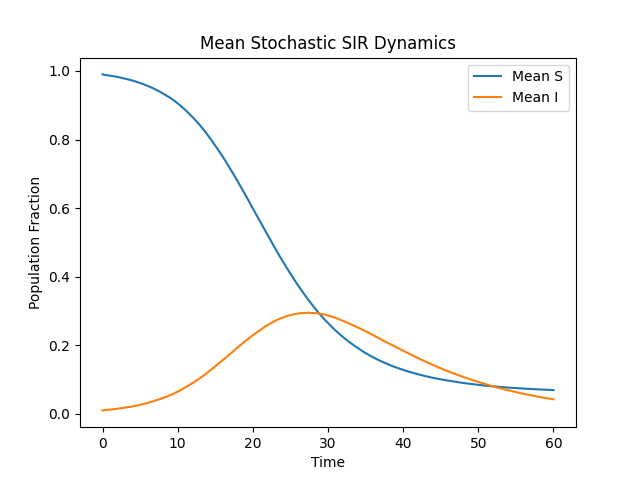
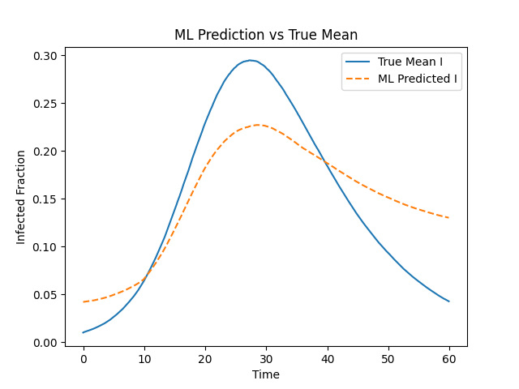
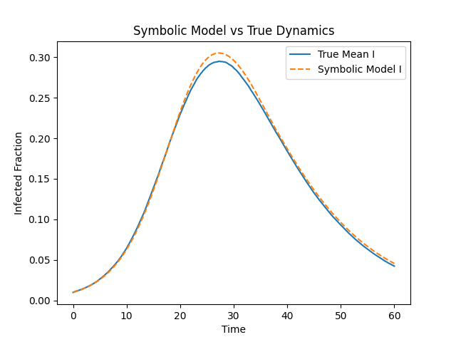

# Learning the Deterministic SIR Model from Stochastic Epidemics

## Overview

This project demonstrates how machine learning and symbolic regression can recover the deterministic **SIR (Susceptible–Infected–Recovered)** model from stochastic epidemic simulations.

Pipeline:

1. Simulate stochastic epidemics (Gillespie algorithm)
2. Compute mean epidemic trajectory
3. Train neural network on mean dynamics
4. Apply sparse symbolic regression (SINDy)
5. Recover interpretable governing equations

---

# True Deterministic Model

dS/dt = -β S I  
dI/dt = β S I - γ I  

Parameters used:

- β = 0.3  
- γ = 0.1  

---

# Results

## 1️⃣ Stochastic Epidemic Trajectories

Below are sample infected trajectories from multiple stochastic simulations.



These trajectories fluctuate due to randomness but converge in expectation.

---

## 2️⃣ Mean Epidemic Curve

Mean S and I curves computed over multiple simulations.



The mean behavior approaches deterministic SIR dynamics.

---

## 3️⃣ Neural Network Prediction vs True Mean

Neural network learned the mapping:

(S(t), I(t)) → (S(t+1), I(t+1))

ML Mean Squared Error:

ML MSE: 0.001893



The neural network closely matches the true mean epidemic curve.

---

## 4️⃣ Recovered Symbolic Model vs True Model

Recovered equations:

S = -0.294 S I  
I = -0.098 I + 0.289 S I  

Estimated parameters:

- β ≈ 0.2937  
- γ ≈ 0.0977  

Parameter error ≈ 2%



The symbolic model overlaps almost perfectly with the true mean trajectory.

---


# Methodology

## Stochastic Simulation
- Gillespie algorithm
- 300–500 runs
- Interpolated to common time grid
- Mean trajectory computed

## Machine Learning
- MLPRegressor
- Two hidden layers
- Supervised learning on time-shifted states

## Symbolic Regression
- Savitzky–Golay smoothing for derivatives
- Polynomial feature library (degree 2)
- STLSQ sparse regression
- Thresholding for interpretability

---

# Dependencies

```bash
pip install numpy matplotlib scikit-learn scipy pysindy
